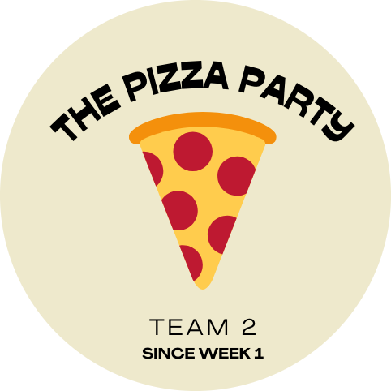

# 🍕 **The Pizza Party** 🍕
### **CSE 110 Team 2 Project.**

[Main Website](https://cs-dictionary.netlify.app/)

[Dev Branch Deployment](https://dev--cs-dictionary.netlify.app/)

# GitHub Actions

`main`: 

`dev`: 

# CodeClimate

# GitHub Actions

`main`: 

`dev`: 

# Documentation

[Documentation](https://cse110-fa22-group2.github.io/team2-fa22-cse110/out/index.html)

<!-- &nbsp; is the same as space " " -->
# **&nbsp; &nbsp; Team Page &nbsp; &nbsp; &nbsp; &nbsp; &nbsp; &nbsp; &nbsp; &nbsp; &nbsp; &nbsp; Miro Board**

&nbsp; &nbsp;
 &nbsp; &nbsp; &nbsp; &nbsp; &nbsp; &nbsp; &nbsp; &nbsp; &nbsp; &nbsp; &nbsp;

# Team Members

## Members:
### [*Sahil Dadhwal*](https://github.com/sahildadhwal)

### [*Nikhil Rao*](https://github.com/nikhilitis)

### [*Yingqi Cao*](https://ioeddk.github.io/Github-Pages/)

### [*Chieh-hsiu Hung*](https://github.com/Chieh0501)

### [*Isaac Varela*](https://github.com/compivar)

### [*Liam Nguyen*](https://github.com/taiokjk)

### [*Thomas Koon*](https://github.com/thomas-koon)

### [*Yunxiao Xu*](https://github.com/YunxiaoXu)

### [*Amaar Valliani*](https://github.com/Amaar-V)

### [*Andrew Jia*](https://github.com/AndrewJia)

