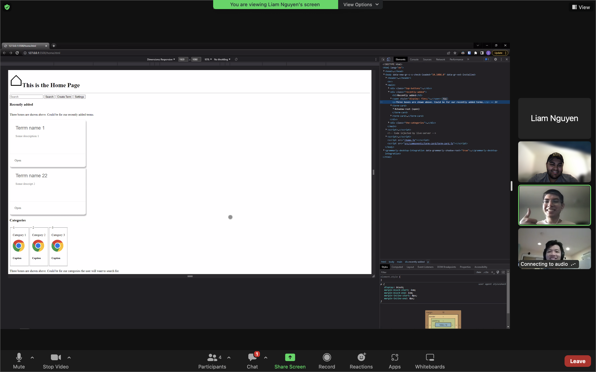

# Team Meeting: Starting Pitch 2!

[Team 2 Members](#team-2-members)

[Meeting Info](#meeting-info)

[Attendance](#attendance)

[Agenda](#agenda)

[Meeting Notes](#meeting-notes)

[Miro Board](https://miro.com/app/board/uXjVPJnCzps=/?share_link_id=992842944391)

[Previous Meeting](https://github.com/cse110-fa22-group2/team2-fa22-cse110/blob/main/admin/meetings/110422-frontend_meeting.md)

## **Team 2 Members**
<ul>

##### <li> *Sahil Dadhwal* </li>
##### <li> *Nikhil Rao* </li>
##### <li> *Yingqi Cao* </li>
##### <li> *Isaac Varela* </li>
##### <li> *Thomas Koon* </li>
##### <li> *Liam Nguyen* </li>
##### <li> *Chieh-hsiu Hung* </li>
##### <li> *Amaar Valliani* </li>
##### <li> *Andrew Jia* </li>
##### <li> *Yunxiao Xu* </li> 
  
</ul>

## **Meeting Info**
#### Meeting Specs: 
<ul>
  <li>November 6, 2022</li>
  <ul>
    <li>Duration:  1 hour and 50 minutes</li>
        <ol>10:00am to 11:50am<ol>
  </ul>
</ul>

#### Meeting Location: 
<ul>
  <li>Virtual Zoom Meeting</li>
</ul>

#### Meeting Type: 
<ul>
  <li>Frontend Meeting 2:</li>
    <i> Team Roles</i>
    <ul>
        <li>Team Leads</li>
            <ul>
                <li>Yingqi Cao</li>
                <li>Nikhil Rao</li>    
            </ul>
        <li>Designers and Frontend (HTML, CSS, JavaScript)</li>
            <ul>
                <li>Sahil Dadwhal</li>
                <li>Liam Nguyen</li>
                <li>Isaac Varela</li>
            </ul>
        <li>Backend (JavaScript)</li>
            <ul>
                <li>Thomas Koon</li>
                <li>Chieh-hsiu (Jerry) Hung</li>
                <li>Yunxiao Xu</li>
            </ul>
        <li>Testing and Devops</li>
            <ul>
                <li>Amaar Valliani</li>
                <li>Andrew Jia</li>
            </ul>
      <li>Everyone</li>
            <ul>
                <li>Document everything</li>
            </ul>
    </ul>
    <li>
        Rules: 
        <ol>
            <li>
                Everyone needs to contribute and be prepared to discuss their contributions.
            </li>
            <li>
                Everyone needs to be active on Slack.
            </li>
            <li>
                Other rules are defined in our team contract.
            </li>
        </ol>
      </li>
    </ul>
</ul>	

## **Attendance**
##### <li> *3 out of 3 (frontend team)* </li>
- [x] Sahil Dadhwal
- [x] Isaac Varela
- [x] Liam Nguyen
    
## **Agenda**
- [x] Create cards from input array that represents input JSON file.
- [x] Implement Lab 6 topics to create cards.
    

## **Meeting Notes**

Work on the agenda and create a webpage that autofills with 2 pre-defined cards. 
<ul>
    <li>Added term card elements to the screen given an input array.</li>
    <li>We will meet Monday at the TA meeting to go over what we have complete!</li>
</ul>

