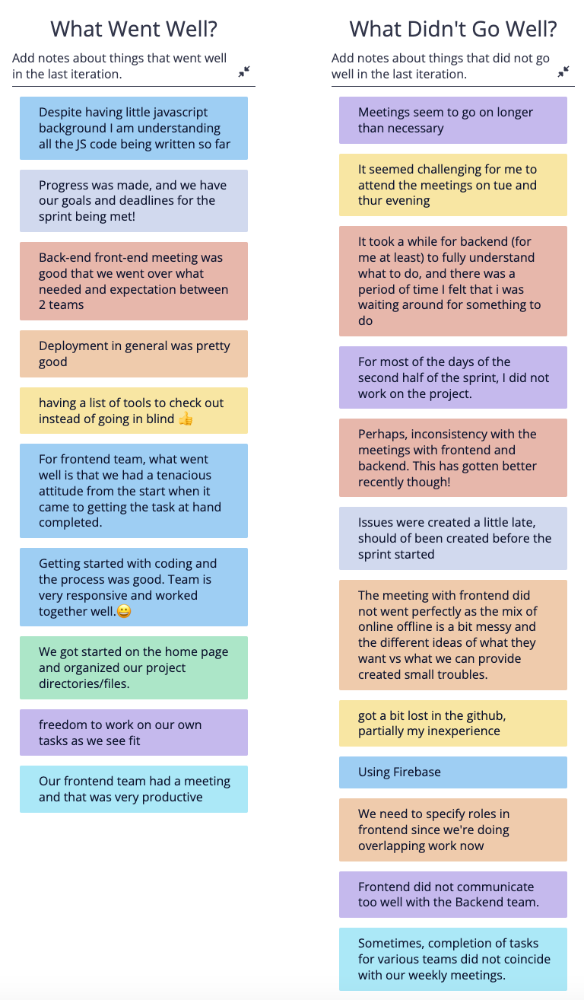
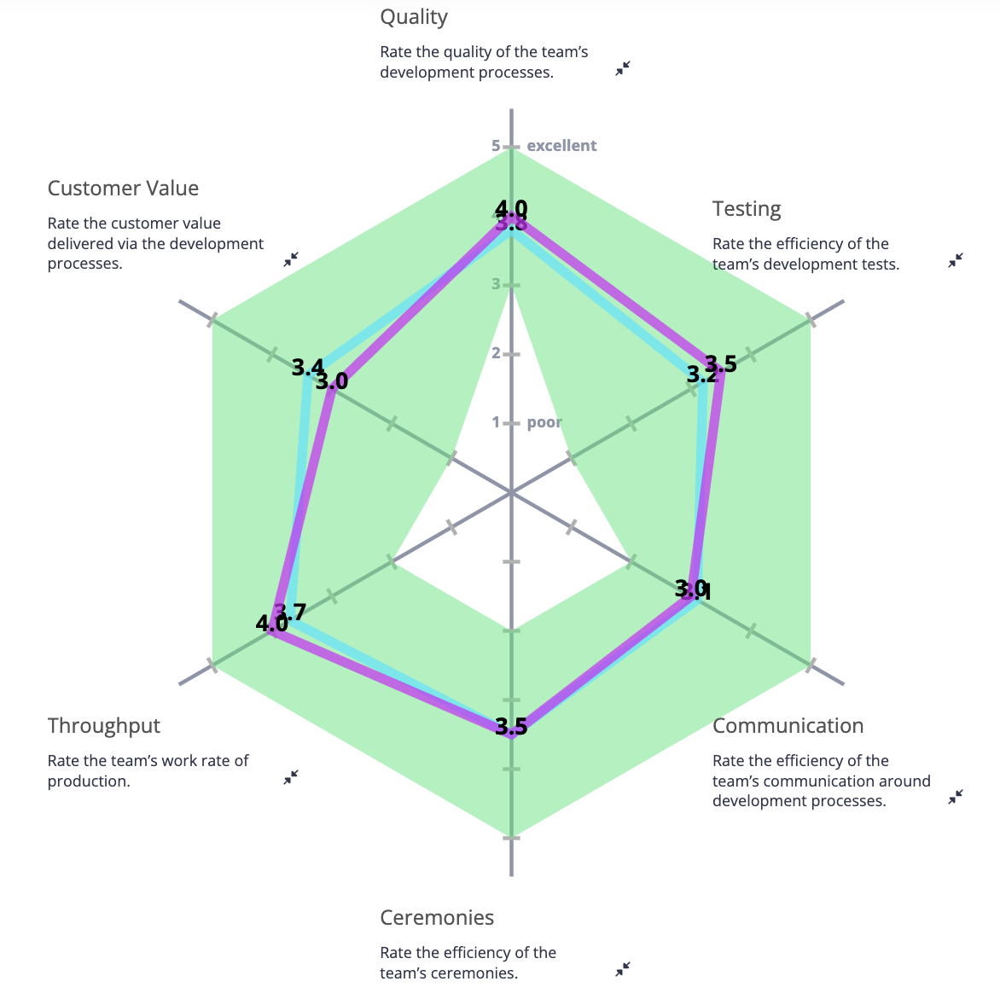

# Retrospective Meeting

[Team 2 Members](#team-2-members)

[Meeting Info](#meeting-info)

[Attendance](#attendance)

[Agenda](#agenda)

[Meeting Notes](#meeting-notes)

## **Team 2 Members**
<ul>

##### <li> *Sahil Dadhwal* </li>
##### <li> *Nikhil Rao* </li>
##### <li> *Yingqi Cao* </li>
##### <li> *Isaac Varela* </li>
##### <li> *Thomas Koon* </li>
##### <li> *Liam Nguyen* </li>
##### <li> *Chieh-hsiu Hung* </li>
##### <li> *Amaar Valliani* </li>
##### <li> *Andrew Jia* </li>
##### <li> *Yunxiao Xu* </li> 
  
</ul>

## **Meeting Info**
#### Meeting Specs: 
<ul>
  <li>November 11, 2022</li>
  <ul>
    <li>Duration: 1 hour and 30 minutes</li>
        <ol>11:30am to 1:00pm<ol>
  </ul>
</ul>

#### Meeting Location: 
<ul>
  <li>Virtual Zoom Meeting </li>
</ul>

#### Meeting Type: 
<ul>
  <li>Retrospective Meeting</li>
    <ul>
      <li>
      Team Leads: 
        <ol>
            Nikhil Rao and Yingqi Cao
        </ol>
      </li>
      <li>
      Rules: 
        <ol>
            <li>
                Everyone needs to contribute and be prepared to discuss their contributions.
            </li>
            <li>
                Everyone needs to be active on Slack.
            </li>
            <li>
                Other rules are defined in our team contract.
            </li>
        </ol>
      </li>
    </ul>
</ul>	

## **Attendance**
##### <li> *10 out of 10* </li>
- [x] Sahil Dadhwal
- [x] Nikhil Rao
- [x] Yingqi Cao
- [x] Isaac Varela
- [x] Thomas Koon
- [x] Liam Nguyen
- [x] Amaar Valliani
- [x] Andrew Jia
- [x] Yunxiao Xu
- [x] Chieh-hsiu Hung 

## **Agenda**
- [x] Discuss what went well this sprint and what could be improved upon.
- [x] Perform the team radar exercise to analyze our team's development processes.
    
## **Meeting Notes**
1) What went well and what can be improved upon:

Some key concerns:
<ul>
    <li>Meetings go on longer than necessary</li>
        <ul>
            <li>We could write down the things people mention and save them for the end</li>
            <li>We need a clear plan for what will happen at each meeting</li>    
        </ul>
    <li>Is there a need for everyone to meet all at once during the week?</li>
        <ul>
            <li>Maybe one meeting on Monday and one on Saturday?</li>
            <li>Maybe have a meeting with the team leads only?</li>
            <li>Monday: stay in lecture hall after lecture. Talk with individual teams in order: testing + devops, frontend, then backend.</li>
            <li>Friday: after lecture with the entire team.</li>
        </ul>
    <li>Issues on GitHub need to be created in a timely manner</li>
        <ul>
            <li>Create issues at our Monday meetings</li>
        </ul>
    <li>Issues with hybrid online-offline</li>
        <ul>
            <li>Communicate well with one another.</li>
            <li>Prioritize in person for smaller group meeting if you can.</li>
            <li>If one person has to be online, then everyone should be online.</li>
        </ul>
    <li>When to push to the dev branch</li>
        <ul>
            <li>You have working code</li>
            <li>You are closing an issue</li>
        </ul>
    <li>Specify roles for the frontend</li>
        <ul>
            <li>One person makes the page</li>
            <li>One person makes the components (term card for instance)</li>
            <li>One person integrates backend with frontend</li>
        </ul>
    <li>Everyone should be filling out daily standups</li>
</ul>

2. Radar Exercise for development processes
