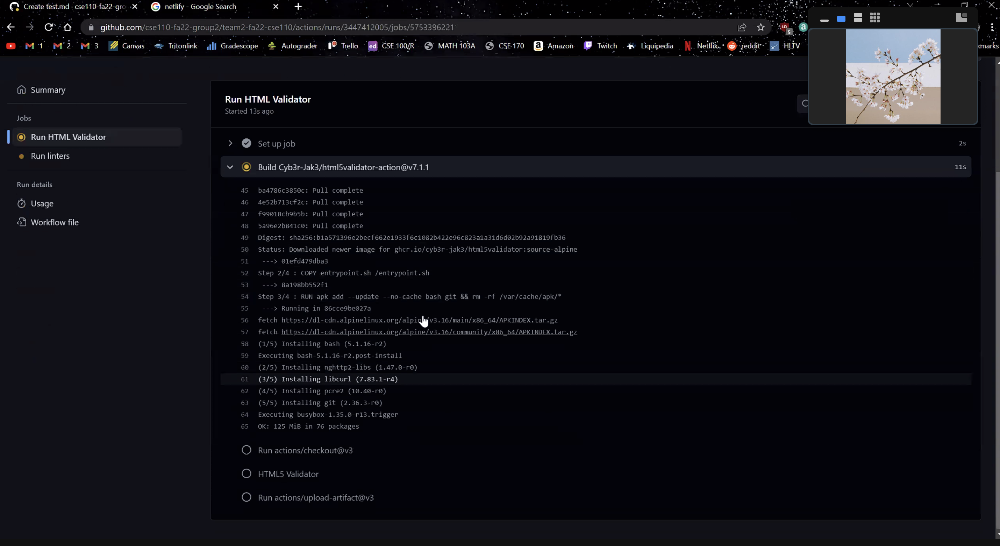
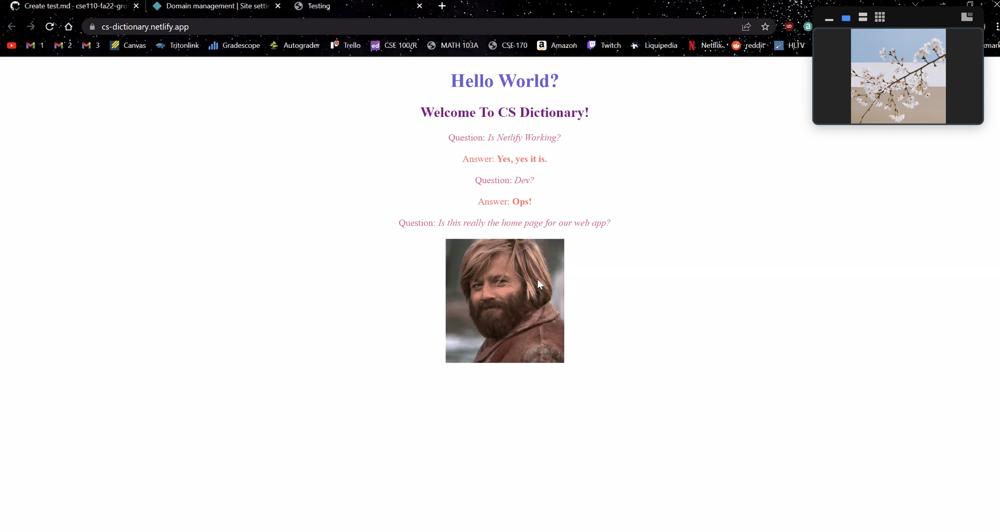
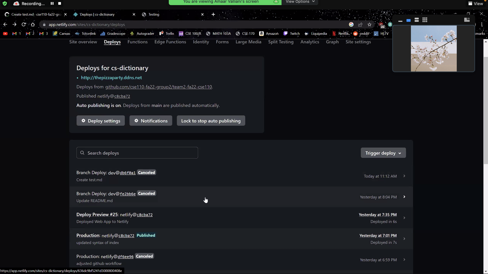
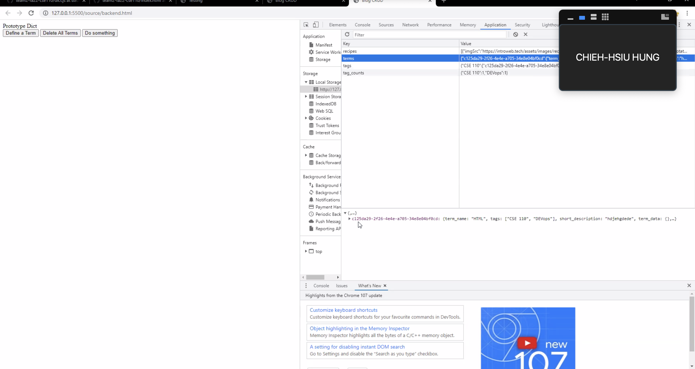
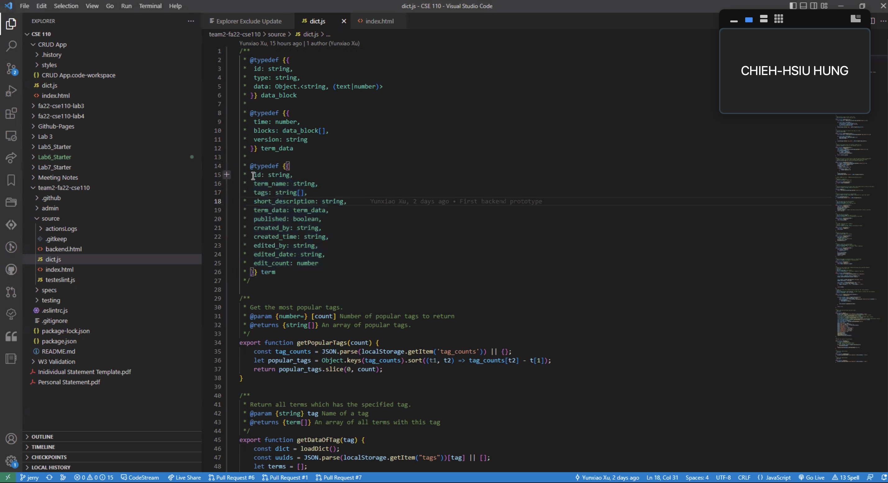
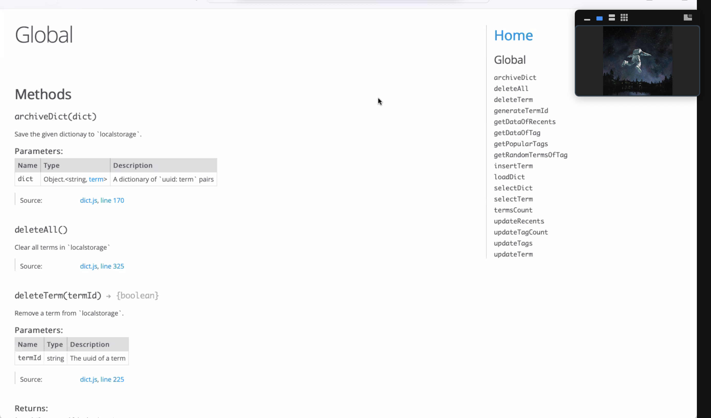

# Sprint 1 Review Meeting

[Team 2 Members](#team-2-members)

[Meeting Info](#meeting-info)

[Attendance](#attendance)

[Agenda](#agenda)

[Meeting Notes](#meeting-notes)

## **Team 2 Members**
<ul>

##### <li> *Sahil Dadhwal* </li>
##### <li> *Nikhil Rao* </li>
##### <li> *Yingqi Cao* </li>
##### <li> *Isaac Varela* </li>
##### <li> *Thomas Koon* </li>
##### <li> *Liam Nguyen* </li>
##### <li> *Chieh-hsiu Hung* </li>
##### <li> *Amaar Valliani* </li>
##### <li> *Andrew Jia* </li>
##### <li> *Yunxiao Xu* </li> 
  
</ul>

## **Meeting Info**
#### Meeting Specs: 
<ul>
  <li>November 11, 2022</li>
  <ul>
    <li>Duration: 30 minutes</li>
        <ol>11:00am to 11:30pm<ol>
  </ul>
</ul>

#### Meeting Location: 
<ul>
  <li>Virtual Zoom Meeting </li>
</ul>

#### Meeting Type: 
<ul>
  <li>Sprint 1 Review Meeting</li>
    <ul>
      <li>
      Team Leads: 
        <ol>
            Nikhil Rao and Yingqi Cao
        </ol>
      </li>
      <li>
      Rules: 
        <ol>
            <li>
                Everyone needs to contribute and be prepared to discuss their contributions.
            </li>
            <li>
                Everyone needs to be active on Slack.
            </li>
            <li>
                Other rules are defined in our team contract.
            </li>
        </ol>
      </li>
    </ul>
</ul>	

## **Attendance**
##### <li> *10 out of 10* </li>
- [x] Sahil Dadhwal
- [x] Nikhil Rao
- [x] Yingqi Cao
- [x] Isaac Varela
- [x] Thomas Koon
- [x] Liam Nguyen
- [x] Amaar Valliani
- [x] Andrew Jia
- [x] Yunxiao Xu
- [x] Chieh-hsiu Hung 

## **Agenda**
- [x] Each team shares what they have accomplished and what they will accomplish by Sunday night.
    
## **Meeting Notes**
Team Reports:
<ul>
    <li>Team Leads</li>
        <ul>
            <li>Members: Nikhil, Yingqi</li>
            <li>Planned meetings 
            <li>Assigned issues</li>
            <li>Attended TA meetings</li>
            <li>Guided the team as team leads</li>
            <li>Took some meeting notes during the meetings</li> 
            <li>Expect code to be in the dev branch by Sunday night</li>
        </ul>
    <li>DevOps</li>
        <ul>
            <li>Members: Amaar, Andrew</li>
            <li>Started with setting up the HTML validator (refer to figure 1 below)</li>
            <li>Added ESLint for styling and code quality</li>
            <li>Amaar explored deploying with Heroku and found it was not free, then tried Firebase but found it to be complicated, and finally tried Netlify which was the easiest service to work with</li>
            <li>Established Netlify as our deployment service (refer to figures 2 and 3 below)</li>
            <li>Plan to set up the custom IP that Liam had set up</li>
        </ul>
    <li>Frontend</li>
        <ul>
            <li>Members: Liam, Sahil, Isaac</li>
            <li>Set up the home page layout with buttons and cards for the terms</li>
            <li>Clicking the buttons take you other html pages</li>
            <li>Liam presented how frontend would like to receive the json from backend</li>
            <li>Plan to add the five most recently add terms to home page</li>
            <li>Plan to add the top three most popular tags to home page. Under each tag will be multiple terms which contain that tag</li>
        </ul>
    <li>Backend</li>
        <ul>
            <li>Members: Thomas, Jerry, Yunxiao</li>
            <li>Talked to the frontend team to understand what they wanted as parameters</li>
            <li>Created the functionality of storing the five most recently added terms</li>
            <li>Created the functionality of creating a term and storing that term to local storage (refer to figure 4 and 5 below)</li>
            <li>Created the functionality of determing tag popularity using counters associated to the tags</li>
            <li>Yunxiao created a documentation site for the javascript functions they are making (refer to figure 6 below)</li>
            <li>Plan to finalize determining the three most popular tags</li>
            <li>Plan on integrating their code with frontend's code</li>
        </ul>
</ul>
    
## Images
    
**Figure 1**

    
**Figure 2**

    
**Figure 3**

    
**Figure 4**

    
**Figure 5**

    
**Figure 6**

    
