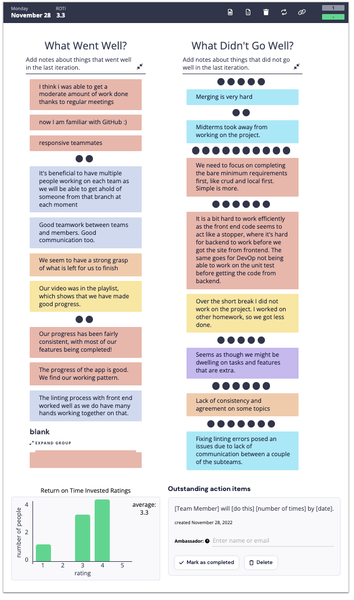

# Retrospective 2 Meeting

[Team 2 Members](#team-2-members)

[Meeting Info](#meeting-info)

[Attendance](#attendance)

[Agenda](#agenda)

[Meeting Notes](#meeting-notes)

[Previous Retro Meeting](https://github.com/cse110-fa22-group2/team2-fa22-cse110/blob/main/admin/meetings/111122-retrospective.md)

## **Team 2 Members**
<ul>

##### <li> *Sahil Dadhwal* </li>
##### <li> *Nikhil Rao* </li>
##### <li> *Yingqi Cao* </li>
##### <li> *Isaac Varela* </li>
##### <li> *Thomas Koon* </li>
##### <li> *Liam Nguyen* </li>
##### <li> *Chieh-hsiu Hung* </li>
##### <li> *Amaar Valliani* </li>
##### <li> *Andrew Jia* </li>
##### <li> *Yunxiao Xu* </li> 
  
</ul>

## **Meeting Info**
#### Meeting Specs: 
<ul>
  <li>November 28, 2022</li>
  <ul>
    <li>Duration: 1 hour and 50 minutes</li>
        <ol>7:00pm to 8:50pm<ol>
  </ul>
</ul>

#### Meeting Location: 
<ul>
  <li>Virtual Zoom Meeting </li>
</ul>

#### Meeting Type: 
<ul>
  <li>Retrospective 2 Meeting</li>
    <ul>
      <li>
      Team Leads: 
        <ol>
            Nikhil Rao and Yingqi Cao
        </ol>
      </li>
      <li>
      Rules: 
        <ol>
            <li>
                Everyone needs to contribute and be prepared to discuss their contributions.
            </li>
            <li>
                Everyone needs to be active on Slack.
            </li>
            <li>
                Other rules are defined in our team contract.
            </li>
        </ol>
      </li>
    </ul>
</ul>	

## **Attendance**
##### <li> *9 out of 10* </li>
- [x] Sahil Dadhwal
- [x] Nikhil Rao
- [x] Yingqi Cao
- [x] Isaac Varela
- [x] Thomas Koon
- [x] Amaar Valliani
- [x] Andrew Jia
- [x] Yunxiao Xu
- [x] Chieh-hsiu Hung 
- [ ] Liam Nguyen (traveling)

## **Agenda**
- [x] Discuss what went well this sprint and what could be improved upon.
- [x] Vote on the annonomous comments that are made to see which needs our most attention. 
    
## **Meeting Notes**
1) What went well and what can be improved upon:

