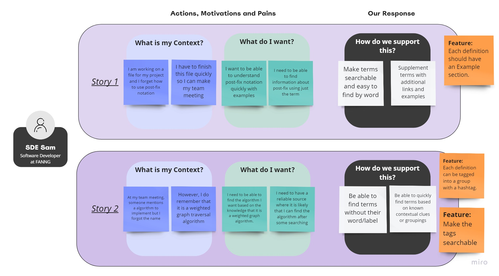
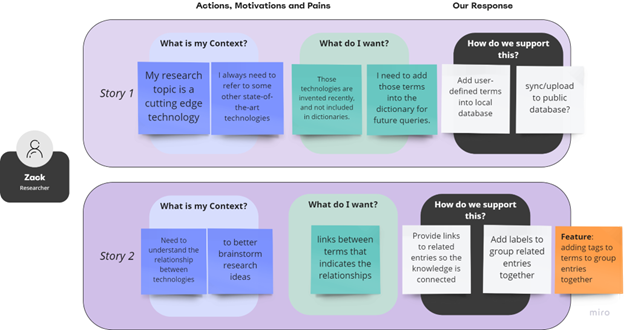
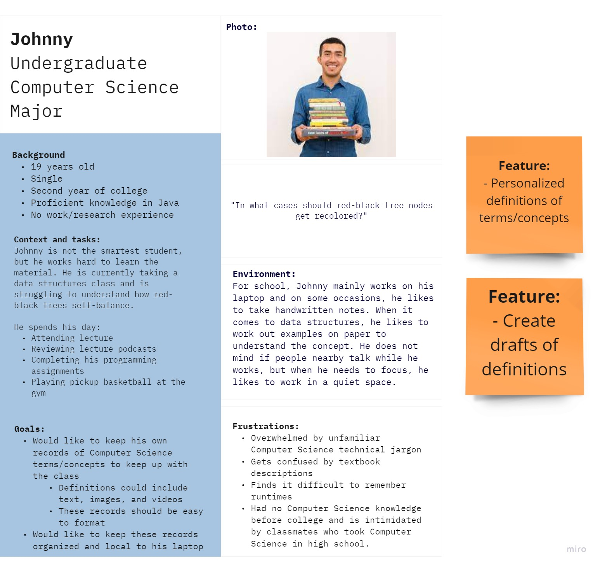
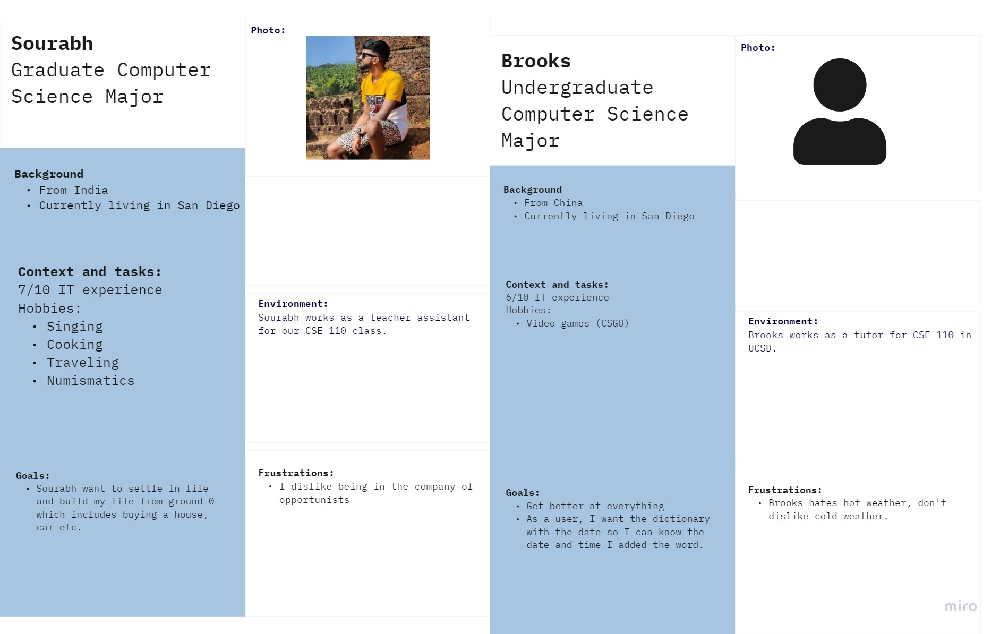
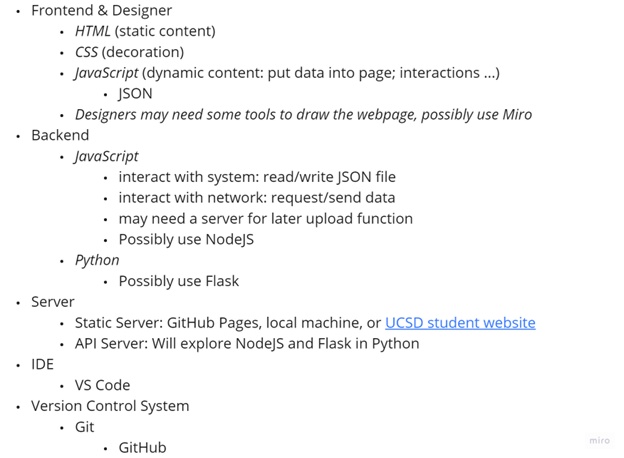

# Starting Pitch
## Problem, Solution, Features, and Priorities 
### Problem

There is a problem we meet in the process of learning. As a group of developers, we are all pursuing an degree in a blooming area that is related to Computer Science. Because of the rapid development of the area in past several decades, it’s knowledge structure is not as well organized as traditional engineering or physical science and the technologies are closely related to the industry. Thus, in the process of learning, it is very frequent that we hear new terms requiring abundant background knowledge to clearly understand, but becoming obstacles to learning other concepts we are focusing on. 

### Solution

In order to help quickly understand some key terms with strong context, it would facilitate us to create a dictionary for the glossary terms emerging from the field of computer science, with the priority of concise and easy to understand way. Also, it should be able to be more personal, since it accommodate people’s different learning styles. Compared to Googling, the dictionary has less redundancy and greater relevance. 

### Features

The first page consists of a list of recently opened terms, for a quick review of newly learned words.

While the user is creating or editing their entries, it allows them to insert texts with different fonts, such as Bold and Italic, code blocks, and some simple multiple media content such as images and short videos. It should also have strong functionality of linking to other terms. This allows users to create their terms in various formats.

There is a tag field to assign a tag for the term for easier categorization. The basic searching feature will return all the terms containing the input string.

A search feature bar that allows the user to search for the terms they have, by name. Additionally, the user will be able to filter by tag and date added. Searching is a key feature in any dictionary-like information management system.
It allows users to save an unfinished definition as a draft and continue editing later, since defining an unknown term can take time as a learning process.

### Priority
1. The user input (inline hyperlinks to other terms).
2. Search bar.
3. Tags.
4. Draft feature, and able to edit after it.
5. A section of links to related terms.

## User Personas
### Persona 1

  

  

### Persona 2

  

  

## Statement of Purpose
Why build a dictionary application?
- In the field of computer science, there are many technical terms that are daunting and confusing for those who are unfamiliar with the terms or are new to the field. Having a dictionary with short and to-the-point definitions is very useful for those who may want to quickly add to their understanding of a particular term in the CS area without learning it in its entirety. This application is an alternative to Quizlet, which is helpful as a set of flashcards but is not as versatile as our application for CS-specific purposes. Our application will be designed for someone who needs to record a term in a hurry, such as a software engineer whose manager throws out technical terms in a fast-paced meeting, or a student studying for their first computer science midterm.
- Users will benefit from our application by being able to have a space where they can look up or study computer science terminology within a CS-specific environment. There is great freedom in how users choose to define terms, but there are also some limitations in order to keep the application aesthetically pleasing and functional.
- Why are we building an application? As CSE 110 students, we have the goal of learning more about software engineering and the development process. We have the objective of creating a functional application that keeps the user in mind. Ultimately, our application will both further our understanding of software engineering, including application development aspects and user-centric design.

Why these particular features?
- Our main feature is the ability for the user to define their own term, and store that definition locally. They can input multiple types of media: ordinary text, code, images, videos, and internet links. They can also bold/italicize text as they see fit. This feature is necessary so that the dictionary's terms can be created.
- The search bar is key for a user to be able to quickly find a term that they would like to review. The keyword-based search will be useful to those who already know what term they want to find, and the filter-based search will be useful for those looking for terms within specific tags. Without a search bar, a user would have to scroll through many terms and would not be easily able to find what they are looking for.
- Another feature will be having drafts of unfinished dictionary definitions. If anyone wants to start the term but is unable to finish, their definition will be placed into the "drafts" section using a "save as draft" button. Similarly, a user can edit a term that they created using an "edit" button. These features are necessary so that there is no pressure on the user to perfect a term's definition on the first try.
- In addition, one key feature is the use of tags. Tags are user-defined, such as #dijkstra or #javascript. Tags are used to group various terms together in order for the user to easily query their set of definitions.
- Links to related terms at the bottom of a term definition is useful for those trying to revise terms within a specific area. For instance, a user on the definition for “inheritance” might be interested in also reviewing “polymorphism”, which might be a similar term listed at the bottom. Having the related terms be clickable links makes it easy for users to get to the term they want faster.
- Some other smaller features include a date added label for each term and a recently added/viewed section for a user to so a user can learn/revise any terms that are immediately relevant to them. Additionally, a preview of a term’s definition on hover would be useful for a user to tell immediately if that is what they are looking for.

## Other Project Components
### Competitor Apps

  

### Project Roadmap
Week 6
- Have preliminary website pages up and running.
- Get started planning the backend architecture.
- Start basic GitHub Actions pipeline.
- Deploy basic html files.

Week 7
- Continue creating all of the webpages.
- Create search functionality.
- Extract user input.
- Begin unit testing.

Week 8
- Create tags feature.
- Create draft and edit features.

Week 9-10
- Add final webpages and backend functionalities.
- Refactor all code in order to adhere to coding standards.
- Final debugging and documenting.

All Weeks
- Adding to GitHub Actions pipeline and unit tests.
- Documenting code that is written.

### System Diagrams

  

### Wireframes
On Miro to access the *[wireframe](https://miro.com/app/board/uXjVPIHNajU=/?share_link_id=812855525631)*.

### Technologies

  

### Risks, Rabbit Holes, and No Goes

  

Additonal Notes
- No one person is assigned a portion of the website
- Everyone is assigned tasks in groups of 2
  - Each team of 2 can decide how to work together
- Create a development branch
  - Each feature gets their own branch branched off from development
  - Each feature gets merged into development
  - Every so often, development branch gets merged into masters branch
- Everyone adds issues and the person approving the pull request will connect an issue to the pull request
- Everyone pulls from the development branch, then deal with conflicts if they exist, and merge with development branch with a pull request
- Make sure to always collaborate, communicate, and do your part!
- If a certain feature is really hard to implement, then the team can decide not to do it
  - Always consult the TA if the problem gets too difficult

## Team Roles
- Team leads
  - Yingqi
  - Nikhil
- Designers and Frontend (HTML, CSS)
  - Sahil
  - Liam
  - Amaar
- Backend (JavaScript)
  Ex. retrieving files from local storage, putting data in JSON files
  - Thomas
  - Jerry
  - Yunxiao
- Testing
  - Isaac
  - Andrew
- Everyone
  - Document everything

